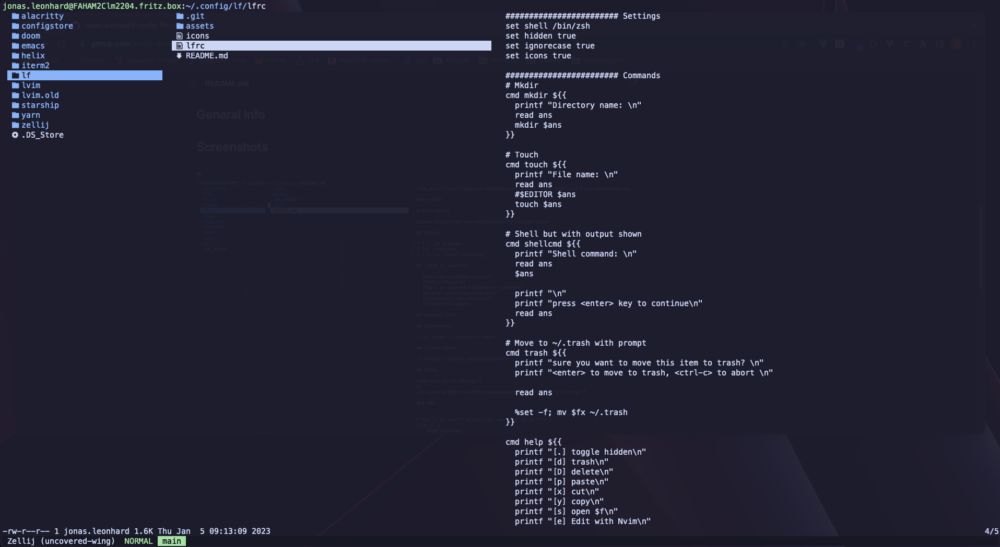

<br/><br/>

# Description

Custom <https://github.com/gokcehan/lf> configuration

## Status

- [ ] _in progress_
- [x] _finished_
- [ ] _no longer continued_

## Table of contents

- [Description](#description)
- [Status](#status)
- [Table of contents](#table-of-contents)
- [General Info](#general-info)
- [Screenshots](#screenshots)
- [Credits](#credits)

## General Info

## Screenshots

<>

## Technologies

lf (<https://github.com/gokcehan/lf>)

## Setup

copy lfrc in ~/.config/lf or

```
git clone git@github.com:JonasLeonhard/lf-config.git ~/.config/lf
```

and add

```
# Use lf to switch directories and bind it to ctrl-f
lfcd () {
    tmp="$(mktemp)"
    lf -last-dir-path="$tmp" "$@"
    if [ -f "$tmp" ]; then
        dir="$(cat "$tmp")"
        rm -f "$tmp"
        [ -d "$dir" ] && [ "$dir" != "$(pwd)" ] && cd "$dir"
    fi
}
bindkey -s '^f' 'lfcd\n'
```

to your .zshrc to open lf via ctrl-f.

to see the keybindings. Press "?" when lf is opened.

## Known Issues / Missing Features

---

## Credits

```
For the ctrl-f opening .zshrc (https://gist.github.com/LukeSmithxyz/e62f26e55ea8b0ed41a65912fbebbe52)
```
